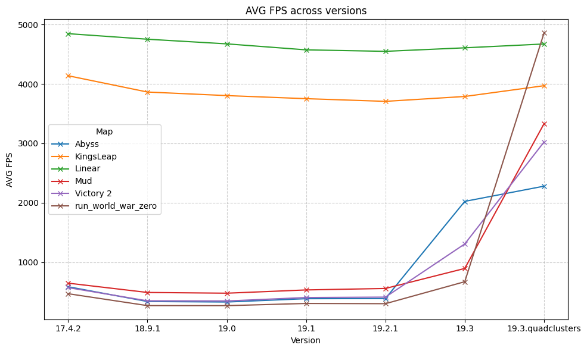

# ddnet-benchmarks

small repository creating and maintaining ddnet benchmarks

## Method

Goal is to download and benchmark a selection of demos for a selection of clients and graph some nice metrics.
In order to prevent other factors we benchmark demos of online gameplay and not online gameplay in order to prevent lag, random text rendering and other influences.
All benchmarks are done in a 30 second demo clip from the beginning

## Selected maps

The map selection is not random. It contains known graphically heavy maps with
- lots of quads like `Mud`, `run_world_war_zero`, `Victory 2`
- lots of quadart like `Abyss`, `KingsLeap`
- lots of popularity like `Linear`

## Create benchmarks

- Select and download the clients you want to benchmark, this can be done automatically
  - configure `client-list.json`
  - run `python scripts/install-clients.py client-list.json`, this will fill the clients directory with the clients you want to benchmark
- initialize benchmark scripts and demos
  - run `python scripts/setup-demos`, this will automatically copy the demos in your data directory and create the benchmark scripts
- Manual step: Run each client and for each client
  - for each demo
    - start the client
    - go to demos
    - select the demo
    - stop the demo
    - go to 0 seconds
    - close the demo UI
    - run `exec benchmark-<mapname>.cfg`. This will automatically
      - run the demo for 30 seconds
      - collect benchmark data
      - save the benchmark data to benchmark-<mapname>.txt
    - close the client
- run `python scripts/collect-data` which puts all client benchmarks into the results directory for better data processing
- run the [DDNet_Benchmarking](DDNet_Benchmarking.ipynb) notebook in order to visualize the data and calculate some nice graphs

## Results

