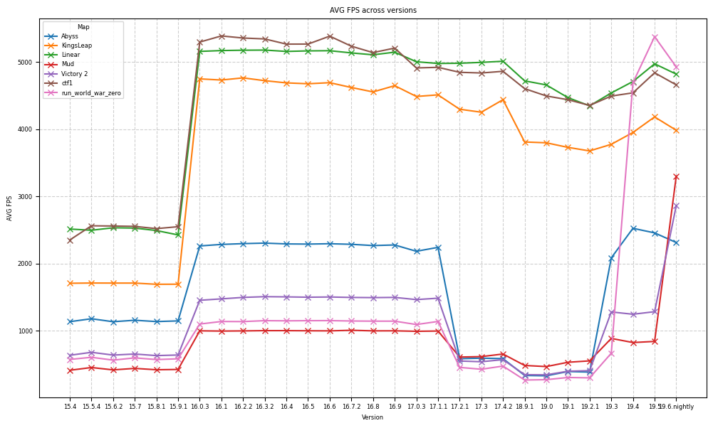

# DDNet-Benchmarks

Small repository creating and maintaining ddnet benchmarks

## Method

Goal is to download and benchmark a selection of demos for multiple client versions and graph some nice metrics.
In order to prevent other factors, we benchmark demos of online gameplay and not online gameplay itself in order to prevent lag, random text rendering (due to chat/server messages) and other influences.
All benchmarks are collected in a 30 second demo clip from the beginning and the collection stops after 30 seconds automatically (even if the demo is longer).

## Selected maps

The map selection is not random. It contains known graphically heavy maps with
- lots of quads like `Mud`, `run_world_war_zero`, `Victory 2`
- lots of quadart like `Abyss`, `KingsLeap`
- lots of popularity like `Linear`

and `ctf1` due to a moderator request

## Create benchmarks

- Select and download the clients you want to benchmark, this can be done automatically
  - configure `client-list.json`
  - run `python scripts/install-clients.py client-list.json`, this will fill the clients directory with the clients you want to benchmark
- Initialize benchmark scripts and demos
  - run `python scripts/setup-demos`, this will automatically copy the demos in your data directory and create the benchmark scripts
- Manual step: Run each client and:
  - for each demo
    - start the client
    - go to demos
    - select the demo
    - stop the demo
    - reset the demo to 0.0 seconds
    - **don't** close the demo UI (not needed, the script automatically closes it)
    - run `exec benchmark-<mapname>.cfg` in the client console (_F1_ key). This will automatically
      - run the demo for 30 seconds
      - collect benchmark data
      - save the benchmark data to benchmark-<mapname>.txt
      - close the client
- Run `python scripts/collect-data` which puts all client benchmarks into the results directory for better data processing
- Run the [DDNet_Benchmarking](DDNet_Benchmarking.ipynb) notebook in order to visualize the data and calculate some nice graphs

## Installation

- Install python3
- Install packages with `pip install -r requirements.txt`
- Use any Jupyter server (like for example [Google Colab](https://colab.research.google.com/) or similar) to visualize the collected data

## Results

